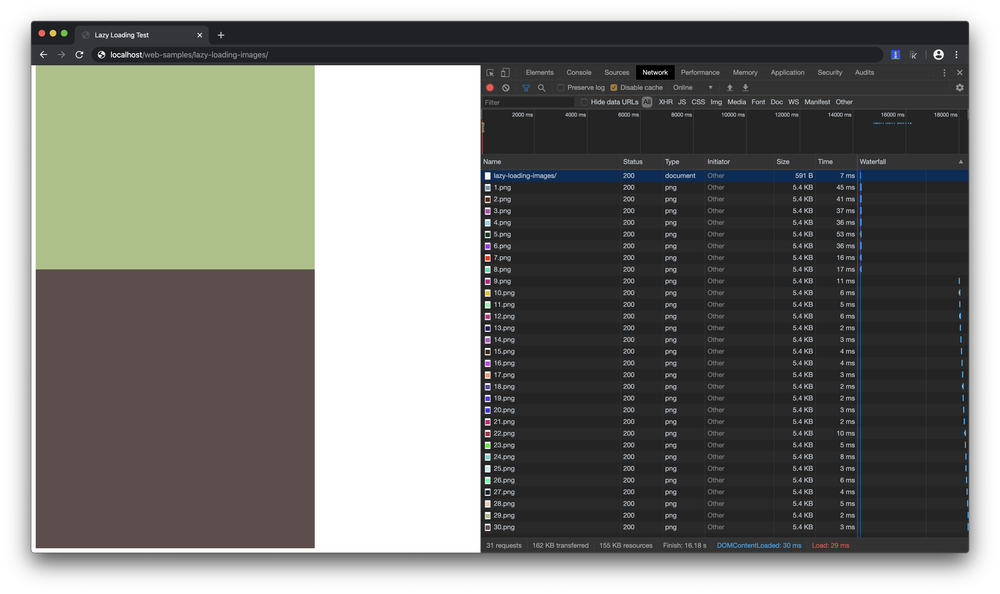

# Lazy loading images

Lazy loading images which are not in the viewport at the moment come native to the web. This is currently only supported in Chrome but if the Browser does not support it, it's no problem. It won't work but it won't break your page either. So you can add it to your page and over time it reaches more users.

You can check out [caniuse.com](https://caniuse.com/#feat=loading-lazy-attr) to see how the support of this feature is at the moment.

The only thing you need to do is to add the loading attribute with the value lazy to your HTML image tag.
```html

```

If you then load this sample page you can see in Chrome Dev Tools that only some of the images are loaded. On the page there are 30 images but it loaded only 8 of them.


When you scroll down until the end of the page, all images were loaded before they are visible. At the end all of the 30 images are loaded.



Below you can see how it looks in the Chrome Dev Tools when you scroll down.


