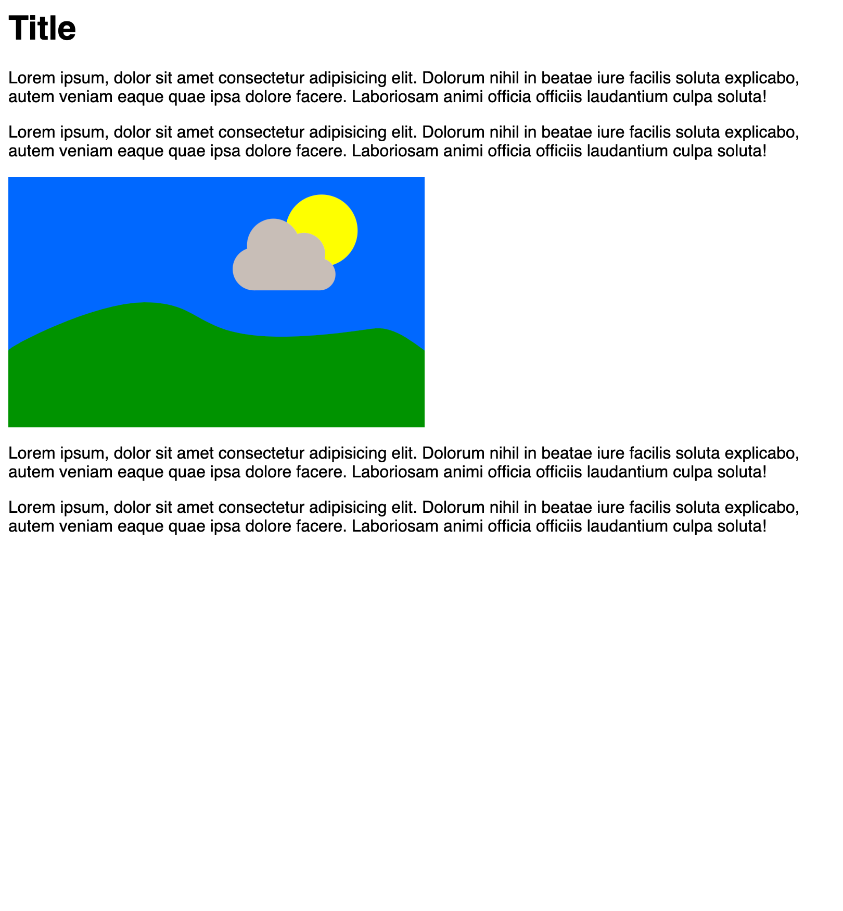
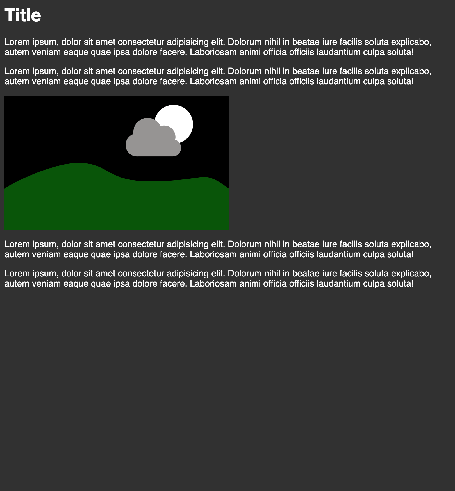

# prefers-color-scheme

All Operation Systems get an Dark Mode implementation. So with prefers-color-scheme we can change the look of our Page if the User has Dark Mode enabled directly in CSS.

Currently this is supported in Safari, Chrome Canary and Firefox Nightly.

## Light

## Dark

